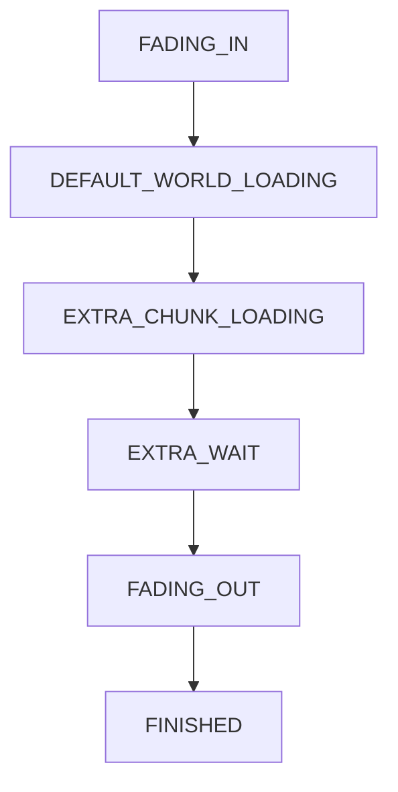

[](https://www.curseforge.com/minecraft/mc-mods/fluxloading)
[](https://www.curseforge.com/minecraft/mc-mods/fluxloading)
[](https://modrinth.com/mod/fluxloading)

## About the Mod
FluxLoading is a mod that enhances immersion by capturing a screenshot of the logout screen and displaying it when you reload your world. When you rejoin, you'll see the exact scene from where you left off, smoothly fading out into real-time gameplay.


## Core Design

FluxLoading is built around three separated subsystems:

- Finite State Machine: loading phase control
- Timeline: time-based animation and transition sequencing (fade-in / wait / fade-out)
- Chunk Gate: decision logic that determines whether extra chunk loading is required before releasing control

## Loading Phases


> **Note**:
> <br> Chunk loading _may_ be waited (`EXTRA_CHUNK_LOADING`) to smoothen the fade-out effect (the decision is made by the Chunk Gate)

## Addon & Integration Guidelines

**Detecting FluxLoading**

```java
if (FluxLoadingAPI.isActive())
{
    // FluxLoading is currently controlling the loading screen
}
```

**Observing Phases**
```java
FluxLoadingPhase phase = FluxLoadingAPI.getPhase();
```

**Lifecycle Hooks**
```java
FluxLoadingAPI.addFluxLoadingStartListener(() -> { ... });
FluxLoadingAPI.addFluxLoadingTickListener(() -> { ... });
FluxLoadingAPI.addFluxLoadingEndListener(() -> { ... });
```

## Player Lock
During loading (`EXTRA_CHUNK_LOADING` or `EXTRA_WAIT` to be exact):
- Player input is locally locked
- Position is locked both client-side and server-side
- Server-side enforcement is supported via packets

## Dependency
- mixinbooter 10.0+

## Compatibility
- [Nothirium](https://www.curseforge.com/minecraft/mc-mods/nothirium)
- [Loading Progress Bar](https://www.curseforge.com/minecraft/mc-mods/loading-progress-bar)
- [AnotherTips](https://www.curseforge.com/minecraft/mc-mods/anothertips)
- [Open Terrain Generator](https://www.curseforge.com/minecraft/mc-mods/open-terrain-generator)
- [Celeritas](https://git.taumc.org/embeddedt/celeritas)
- [Hwyla](https://www.curseforge.com/minecraft/mc-mods/hwyla)
